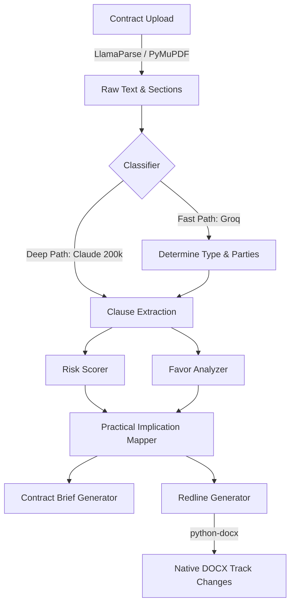

# ⚖️ ForgeSign: The Contract Intelligence Module


**ForgeSign** is the Day 13 module of the AgentOS 30-day challenge. It provides SMEs, freelancers, and growth-stage startups with the contract intelligence previously available only to corporations with in-house legal teams. 

It doesn't just flag risky clauses—it understands the **practical implications**, knows which party the clause favors, generates **native MS Word track-changes redlines**, and coaches the user through the negotiation round-by-round.

---

## 🌟 The Novel Mechanism: Practical Implication Mapping

Most contract tools translate legalese into simpler legalese. **ForgeSign translates abstract legal risk into concrete business consequences.**

For every high-risk clause, the system generates:
1. **Plain English Meaning**: What the clause legally requires.
2. **Real-World Scenarios**: 3 highly specific, numerical business situations where the clause would be invoked (e.g., *"If an outage loses you ₹50L, you can only sue for ₹2L"*).
3. **Favor Analysis**: A strict 1-10 mapping against standard industry benchmarks.
4. **Negotiation Stance**: What pushing back on this clause signals to the counterparty.

---

## 🏗️ System Architecture

ForgeSign utilizes a **Full-Context Analysis** strategy. Because legal contracts rely heavily on cross-references, naive RAG chunking breaks down. ForgeSign feeds the entire parsed PDF/DOCX (up to 200,000 tokens) into Claude in a single pass.



---

## 🧩 Core Capabilities

### 1. 1-Page Business Briefs
Lawyers read linearly; business owners read for risk. ForgeSign distills 50-page PDFs into 5 immediate answers:
- What must I **DO**?
- What do I **GET**?
- What could **HURT** me?
- What is my total **FINANCIAL EXPOSURE**?
- How do I **EXIT**?

### 2. Native Track Changes (`python-docx`)
When a redline is generated, ForgeSign doesn't output plain text. It reconstructs the MS Word XML, injecting `<w:ins>` and `<w:del>` tags. When you send the `.docx` to the counterparty, it natively appears as standard Track Changes made by a human lawyer.

### 3. Counterparty Intelligence Moat
ForgeSign aggregates historical negotiation data into ChromaDB. If the counterparty is a known entity (e.g., Salesforce), it advises on their historical rigidity: *"Don't fight the liability cap; they reject changes 98% of the time. Push for SLA credits instead."*

---

## 🕸️ AgentOS Mesh Integration

ForgeSign is not an isolated tool; it operates as the legal node within the AgentOS ecosystem.

- **GhostCFO (Day 02)**: Auto-renewal traps are instantly detected and cancellation deadlines are broadcast to the GhostCFO financial calendar.
- **RiteOfWay (Day 06)**: During a dispute, ForgeSign packages the violated clause and evidence timeline, sending it to RiteOfWay to draft a legal demand letter.
- **NexusOps (Day 29)**: Acts as an automated sentry, pre-analyzing contracts found in incoming emails before the user opens them.

---

## 📚 Technical Documentation

Deep dive into the ForgeSign mechanics:
1. **[System Architecture & Prompts](docs/ARCHITECTURE.md)**
2. **[Negotiation Intelligence Data Moat](docs/NEGOTIATION_INTELLIGENCE.md)**
3. **[Track Changes XML Redline Mechanics](docs/REDLINE_MECHANICS.md)**

---

## 🏃‍♂️ Running Locally

Ensure your `agentos_mesh` Docker network is active, and your `.env` contains your API keys (Tavily, LlamaParse, Anthropic, Groq).

```bash
# 1. Install dependencies
pip install -r requirements.txt

# 2. Seed the ChromaDB Clause Precedents Library
python server/scripts/seed_clause_library.py

# 3. Start the FastAPI Server and Celery Workers
docker-compose up -d

# 4. Access the UI
# Open frontend/app.html in any modern browser
```

---

> **MANDATORY LEGAL DISCLAIMER**  
> *ForgeSign's analysis is for informational purposes only and does not constitute legal advice. The AI is designed to assist business owners in understanding their risk exposure, but it is not a substitute for a licensed attorney. For legally binding matters, always consult a qualified advocate.*
